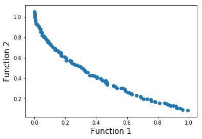
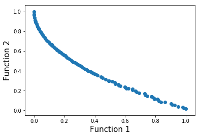
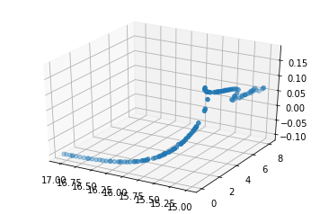

# How fair can we go? Assessing the boundaries of fairness in decision trees

## Abstract

Fair machine learning works have been focusing on the develop-ment of equitable algorithms that address discrimination of certaingroups. Yet, many of these fairness-aware approaches aim to obtaina unique solution to the problem, which leads to a poor understand-ing of the statistical limits of bias mitigation interventions.

We present the first methodology that allows to explore thoselimits within a multi-objective framework that seeks to optimizeany measure of accuracy and fairness and provides a Pareto frontwith the best feasible solutions. In this work, we focus our study ondecision tree classifiers since they are widely accepted in machinelearning, are easy to interpret and can deal with non-numericalinformation naturally.

We conclude experimentally that our method can optimize deci-sion tree models to be fair without compromising accuracy, whichcontrasts with some preliminary works in the field. However, byguiding global optimization by the non-discriminatory objective,the learning algorithm tends to produce more complex models. Webelieve that our contribution will help stakeholders of sociotechni-cal systems to assess how far they can go by being fair, accurateand explainable.

## Experimentation

We conduct an extensive set of experiments based on 5 real-world datasets, which are widely used in the fairness literature.The solution space obtained by our approach indicates that thereexists a wide number of optimal solutions (Pareto optimal), thatare characterized by not being dominated by each other. We alsoevaluate the boundaries between accuracy and fairness that canbe achieved on each problem, giving an empirical visualizationof the limits between both measures. In addition, we assess howdecision trees hyperparameters are affected by this tradeoff. Finally,a convergence analysis is also presented in order to evaluate theevolutionary approach of this methodolog

* ZDT1 
* ZDT4 
* VIENNET 

