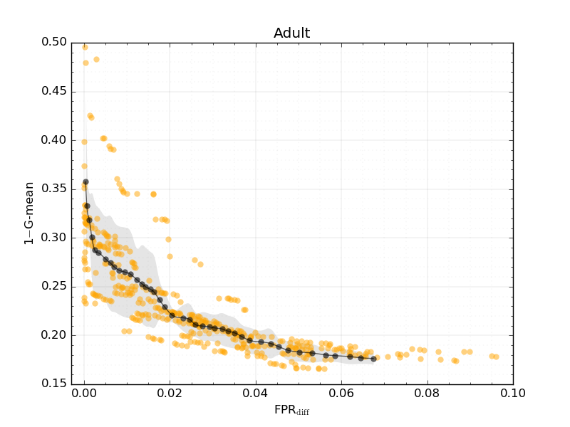
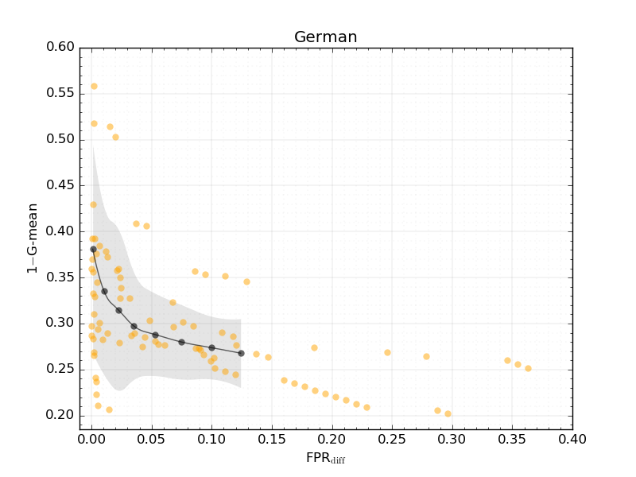

# How fair can we go in machine learning? Assessing the boundaries of fairness in decision trees

## Abstract

Fair machine learning works have been focusing on the development of equitable algorithms that address discrimination of certain groups. Yet, many of these fairness-aware approaches aim to obtain a unique solution to the problem, which leads to a poor understanding of the statistical limits of bias mitigation interventions.

We present the first methodology that allows to explore those limits within a multi-objective framework that seeks to optimize any measure of accuracy and fairness and provides a Pareto front with the best feasible solutions. In this work, we focus our study on decision tree classifiers since they are widely accepted in machine learning, are easy to interpret and can deal with non-numerical information naturally.

We conclude experimentally that our method can optimize decision tree models by being fairer with a small cost of the classification error. We believe that our contribution will help stakeholders of sociotechnical systems to assess how far they can go being fair and accurate, thus serving in the support of enhanced decision making where machine learning is used.

## Experimentation

We conduct an extensive set of experiments based on 5 real-world datasets, which are widely used in the fairness literature. The solution space obtained by our approach indicates that thereexists a wide number of optimal solutions (Pareto optimal), that are characterized by not being dominated by each other. We also evaluate the boundaries between accuracy and fairness that canbe achieved on each problem, giving an empirical visualization of the limits between both measures. In addition, we assess how decision trees hyperparameters are affected by this tradeoff. Finally, a convergence analysis is also presented in order to evaluate theevolutionary approach of this methodology.

**Figure:** Orange dots represent Pareto optimal solutions (minimizing error (1-G-mean) vs. unfairness (FPRdiff)) found by the proposed algorithm in different problems. Dark gray dots indicate the average Pareto set, which is a way of representing *how fair can we go* in a specific problem or, in other words, which shape takes the accuracy-fairness tradeoff. Light gray area is the interquartile range. Our methodology is effective to find a wide spread of solutions that are accurate and fair at the same time. In the two ProPublica datasets, the meta-learning algorithm also finds better solutions than the obtained by COMPAS (red dots), showing that there is a wide range of possibilities to be fairer without worsening accuracy.

## Citation:

---
@article{valdivia2021fair,
  title={How fair can we go in machine learning? Assessing the boundaries of accuracy and fairness},
  author={Valdivia, Ana and S{\'a}nchez-Monedero, Javier and Casillas, Jorge},
  journal={International Journal of Intelligent Systems},
  volume={36},
  number={4},
  pages={1619--1643},
  year={2021},
  publisher={Wiley Online Library}
}
---
