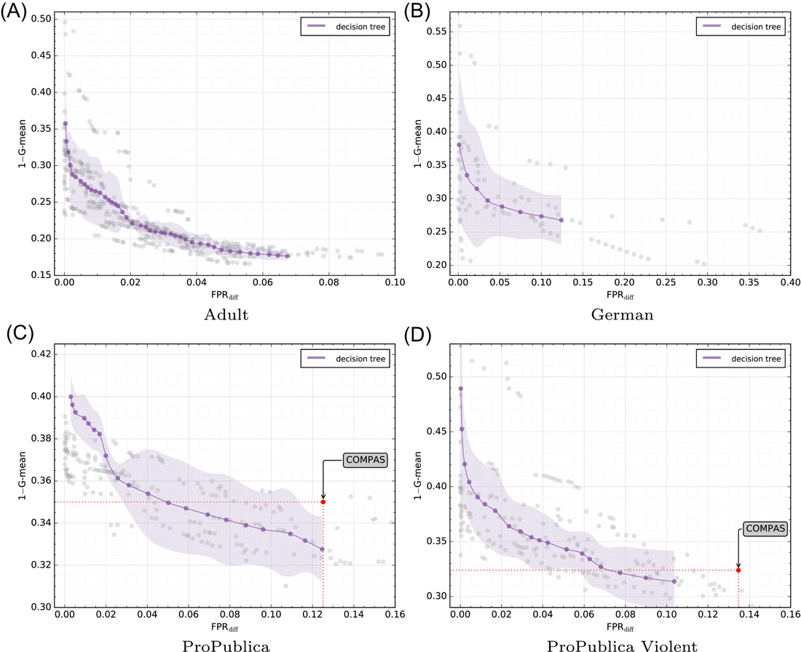

# How fair can we go in machine learning? Assessing the boundaries of accuracy and fairness 

## Abstract

Fair machine learning has been focusing on the development of equitable algorithms that address discrimination. Yet, many of these fairness-aware approaches aim to obtain a unique solution to the problem, which leads to a poor understanding of the statistical limits of bias mitigation interventions. In this study, a novel methodology is presented to explore the tradeoff in terms of a Pareto front between accuracy and fairness. To this end, we propose a multiobjective framework that seeks to optimize both measures. The experimental framework is focused on logistic regression and decision tree classifiers since they are well-known by the machine learning community. We conclude experimentally that our method can optimize classifiers by being fairer with a small cost on the classification accuracy. We believe that our contribution will help stakeholders of sociotechnical systems to assess how far they can go being fair and accurate, thus serving in the support of enhanced decision making where machine learning is used.

## Experimentation

We propose a methodology based on the nondominated sorting genetic algorithm II (NSGA-II) to train a set of classifiers that best tradeoff accuracy and fairness. To obtain the Pareto optimal solutions, the meta-heuristic algorithm will optimize the combination of learner parameters. The selection mechanisms are inspired by the elitist NSGA-II method which was described in the previous section. As proof of concept, we tested our methodology with logistic regression and decision trees as base ML classifiers. 

**Figure:** Solutions obtained with decision tree classifiers. Gray dots represent Pareto optimal solutions—minimizing error (I–G-mean) versus unfairness ( FPRdiff)—found by the proposed algorithm in different problems. Violet dots indicate the average Pareto set, which is a way of representing how fair can we go with decision trees in a specific problem or, in other words, which shape takes the accuracy-fairness tradeoff with such a kind of classifier. Light violet area is the interquartile range. Our methodology is effective to find a wide spread of solutions that are accurate and fair at the same time. In the two ProPublica data sets, the meta-learning algorithm also finds better solutions than the obtained by COMPAS (red dots), showing that there is a wide range of possibilities to be fairer without worsening accuracy.

## Citation

Valdivia, A., Sánchez‐Monedero, J., & Casillas, J. (2021). **How fair can we go in machine learning? Assessing the boundaries of accuracy and fairness**. *International Journal of Intelligent Systems*, 36(4), 1619-1643.
